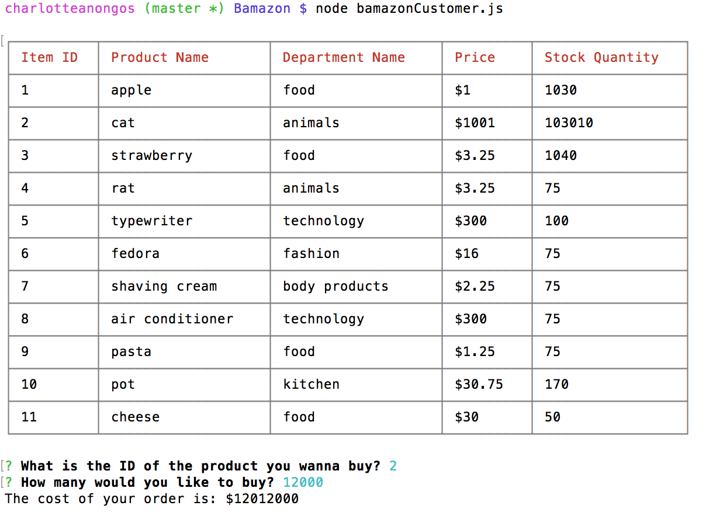
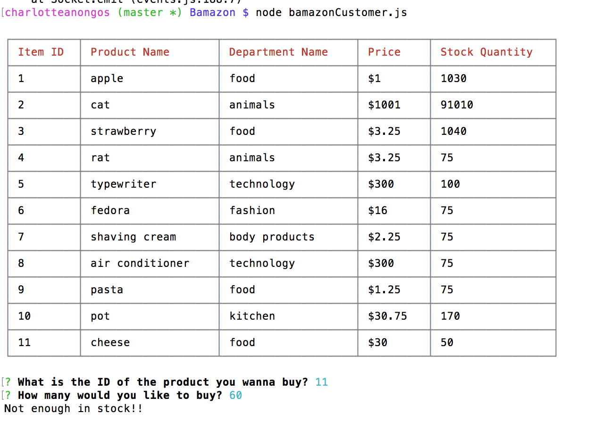
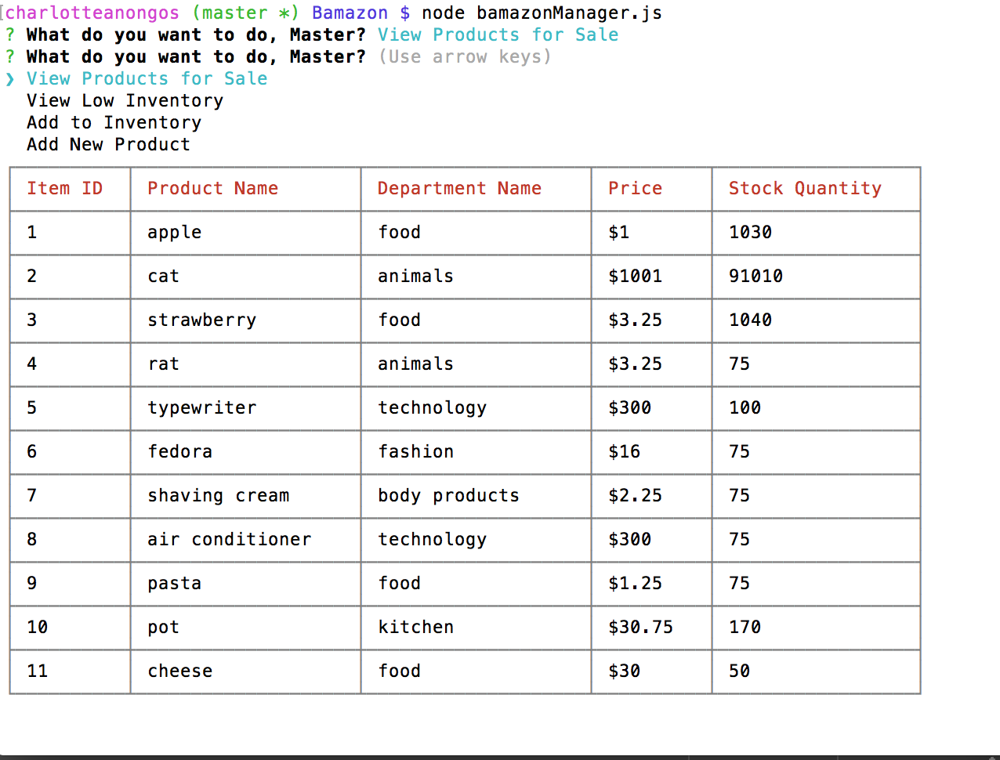
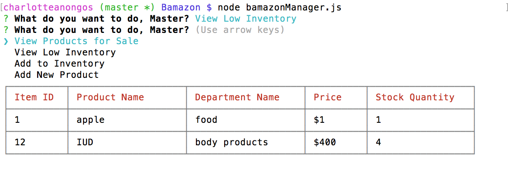
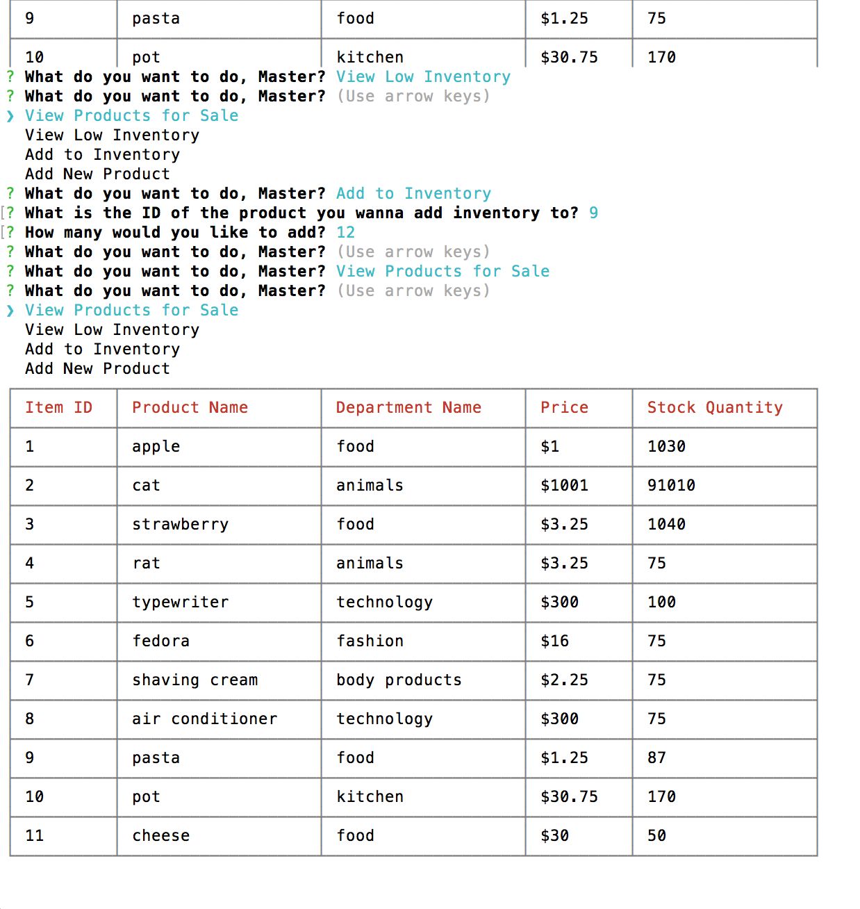
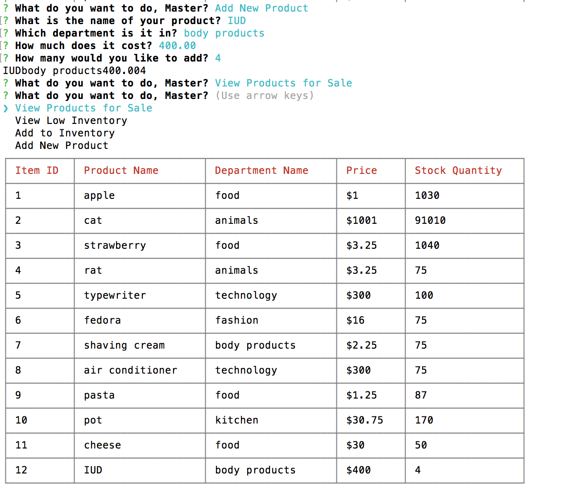

# Bamazon!

Command line application that lets the user buy items from an Amazon-like storefront.

## Description on how to use the app

* Use command "node bamazonCustomer.js" to view available products.
	1. Input the id of the product to buy.
	2. Input the amount to order.
	3. Your total order price will be calculated.
	4. An updated table with the new stock quantity will print out.

* Use command "node bamazonManager.js" to start the manager view. From here you can:
	1. View Products for Sale
	2. View Low Inventory
	3. Add to Inventory
	4. Add New Product

  * If a manager selects `View Products for Sale`, the app should list every available item: the item IDs, names, prices, and quantities.

  * If a manager selects `View Low Inventory`, then it should list all items with a inventory count lower than five.

  * If a manager selects `Add to Inventory`, your app should display a prompt that will let the manager "add more" of any item currently in the store.

  * If a manager selects `Add New Product`, it should allow the manager to add a completely new product to the store.

## Requirements

1. Create a MySQL Database called `Bamazon`.

2. Then create a Table inside of that database called `products`.

3. The products table should have each of the following columns:

   * item_id (unique id for each product)

   * product_name (Name of product)

   * department_name

   * price (cost to customer)

   * stock_quantity (how much of the product is available in stores)

4. Populate this database with around 10 different products. (i.e. Insert "mock" data rows into this database and table).

## Technologies Used 
* nodeJS
* mySQL
* npm packages: cli-table, inquirer, mysql

## Code Explanation

### Buying items as a customer

---

### Buying item with insufficient stock

---

### Viewing products

---

### Viewing low inventory

---

### Add to inventory

---

### Add new product

